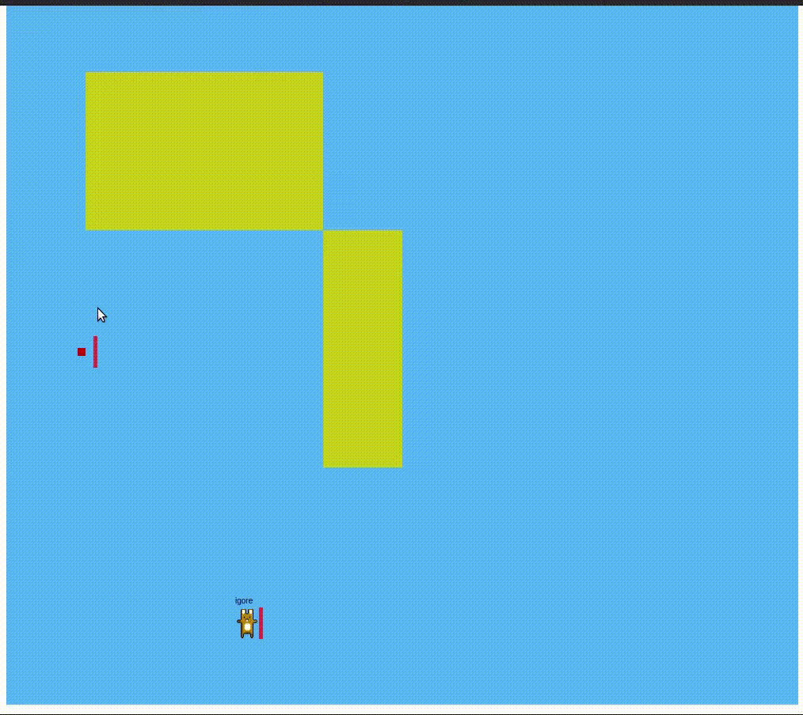
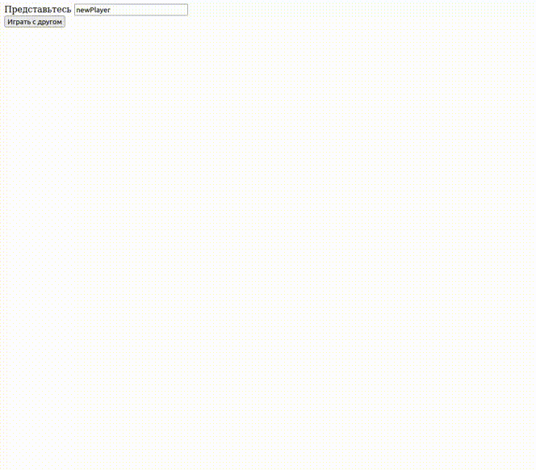

# Пример игры

Сетевая игра на Go, все вычисления на бекенде, поддерживает лобби

# Demo

## How to run

1. go build -o main
2. ./main
3. cd web
4. npm install
5. npm run build
6. [`http://localhost:3000/`](http://localhost:3000/)
